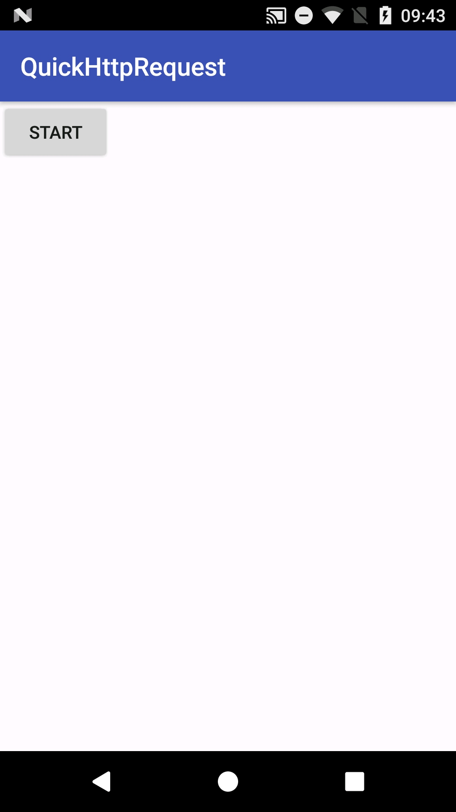
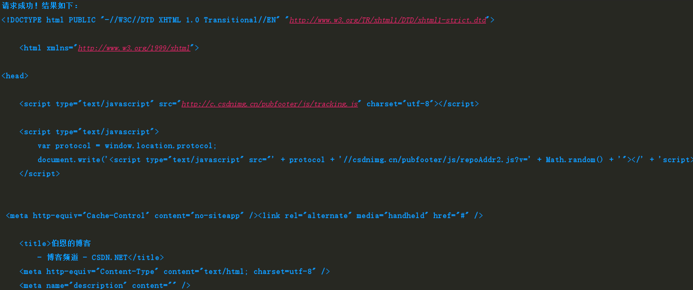

# [QuickHttpRequest](http://blog.csdn.net/iromkoear/article/details/70037954)

很多时候，我们要测试某个网络请求，这时候就得有一个快速上手的网络请求框架方便使用。


## **使用步骤**

下面是一个Retrofit+okHttp3的网络请求的例子，使用步骤如下：


请求链接：

```
http://blog.csdn.net/iromkoear?viewmode=contents
```

使用方式：

1、在MainActivity里面修改服务器地址和参数
```
 /**
     * 服务器地址(请手动修改1)
     */
    public static String BASEURL = "http://blog.csdn.net/";
```

```
    /**
     * 请求的参数实体(请手动修改2)
     */
    public class MyParams {
        /**
         * 参数
         */
        public String viewmode;
    }
```

2、在IHttpInfo里面修改接口参数
```
  /**
     * 接口参数(请手动修改3)
     */
    @POST("/iromkoear")
    Call<String> getResult(@Query("viewmode") String viewmode);
```

3、在MainActivity开始请求

```
 MyParams myParams = new MyParams();
        myParams.viewmode ="contents";

        Call<String> infoCall = httpInfoModel.getIHttpInfo().getResult(myParams.viewmode);

        infoCall.enqueue(new Callback<String>() {
            @Override
            public void onResponse(Call<String> call, Response<String> response) {
                String result = response.body().trim();
                Log.i(TAG, "请求成功！结果如下：");
                Log.i(TAG, result);
            }

            @Override
            public void onFailure(Call<String> call, Throwable t) {
                Log.i(TAG, "请求失败！");
            }
        });
```

只要3步就可以完成一个简单的请求






## **详细代码**

#### **1、在项目的build里面添加：**

```
dependencies {
    compile fileTree(dir: 'libs', include: ['*.jar'])
    androidTestCompile('com.android.support.test.espresso:espresso-core:2.2.2', {
        exclude group: 'com.android.support', module: 'support-annotations'
    })
    compile 'com.android.support:appcompat-v7:25.0.0'

    testCompile 'junit:junit:4.12'
    compile 'com.squareup.okhttp3:okhttp:3.3.1'
    compile 'com.squareup.retrofit2:retrofit:2.1.0'
    compile 'com.squareup.retrofit2:converter-gson:2.1.0'
    compile 'com.squareup.retrofit2:adapter-rxjava:2.1.0'
    compile 'io.reactivex:rxandroid:1.1.0'
    compile 'io.reactivex:rxjava:1.1.0'
    compile 'com.squareup.okhttp3:logging-interceptor:3.3.1'
}
```

#### **2、AndroidMainifest文件**

```
<?xml version="1.0" encoding="utf-8"?>
<manifest xmlns:android="http://schemas.android.com/apk/res/android"
          package="com.bourne.quickhttprequest">

    <!-- 网络请求权限 -->
    <uses-permission android:name="android.permission.INTERNET"/>
    <!-- 在SDCard中创建与删除文件权限 -->
    <uses-permission android:name="android.permission.MOUNT_UNMOUNT_FILESYSTEMS"/>
    <!-- 往SDCard写入数据权限 -->
    <uses-permission android:name="android.permission.WRITE_EXTERNAL_STORAGE"/>
    <!-- 往SDCard读取数据权限 -->
    <uses-permission android:name="android.permission.READ_EXTERNAL_STORAGE"/>

    <application
        android:allowBackup="true"
        android:icon="@mipmap/ic_launcher"
        android:label="@string/app_name"
        android:roundIcon="@mipmap/ic_launcher_round"
        android:supportsRtl="true"
        android:theme="@style/AppTheme">
        <activity android:name=".MainActivity">
            <intent-filter>
                <action android:name="android.intent.action.MAIN"/>

                <category android:name="android.intent.category.LAUNCHER"/>
            </intent-filter>
        </activity>
    </application>

</manifest>
```

#### **3、MainActivity**

```
package com.bourne.quickhttprequest;

import android.os.Bundle;
import android.support.v7.app.AppCompatActivity;
import android.util.Log;
import android.view.View;

import retrofit2.Call;
import retrofit2.Callback;
import retrofit2.Response;

public class MainActivity extends AppCompatActivity {

    /**
     * Log标志
     */
    private String TAG;

    /**
     * 服务器地址(请手动修改1)
     */
    public static String BASEURL = "http://blog.csdn.net/";

    /**
     * 网络请求
     */
    private HttpInfoModel httpInfoModel;

    @Override
    protected void onCreate(Bundle savedInstanceState) {
        super.onCreate(savedInstanceState);
        setContentView(R.layout.activity_main);
        TAG = getLocalClassName();
        //初始化网络请求
        httpInfoModel = HttpInfoModel.getInstance(this);
    }


    /**
     * 开始请求
     */
    public void startHttpRequest(View view) {

        Call<String> infoCall = httpInfoModel.getIHttpInfo().getResult("contents");

        infoCall.enqueue(new Callback<String>() {
            @Override
            public void onResponse(Call<String> call, Response<String> response) {
                String result = response.body().trim();
                Log.i(TAG, "请求成功！结果如下：");
                Log.i(TAG, result);
            }

            @Override
            public void onFailure(Call<String> call, Throwable t) {
                Log.i(TAG, "请求失败！");
            }
        });
    }

}

```

#### **4、新建一个类HttpInfoModel，是一个网络请求单例**

```
package com.bourne.quickhttprequest;

import android.content.Context;

/**
 * 网络请求单例
 */
public class HttpInfoModel {

    private static HttpInfoModel famousInfoModel;
    private IHttpInfo mIHttpInfo;

    public HttpInfoModel(Context context) {
        mIHttpInfo = RetrofitWrapper.getInstance(MainActivity.BASEURL).create(IHttpInfo.class);
    }

    public static HttpInfoModel getInstance(Context context) {
        if (famousInfoModel == null) {
            famousInfoModel = new HttpInfoModel(context);
        }
        return famousInfoModel;
    }

    public IHttpInfo getIHttpInfo() {
        return mIHttpInfo;
    }

}

```

#### **5、新建一个类IHttpInfo，请求参数接口**

```
package com.bourne.quickhttprequest;


import retrofit2.Call;
import retrofit2.http.POST;
import retrofit2.http.Query;

/**
 * 请求参数接口
 */
public interface IHttpInfo {

    /**
     * 接口参数(请手动修改2)
     */
    @POST("/iromkoear")
    Call<String> getResult(@Query("viewmode") String viewmode);

}

```

#### **6、新建一个类RetrofitWrapper，是网络请求的主体**

```
package com.bourne.quickhttprequest;

import android.content.Context;
import android.util.Log;

import com.google.gson.Gson;
import com.google.gson.GsonBuilder;

import okhttp3.OkHttpClient;
import okhttp3.logging.HttpLoggingInterceptor;
import retrofit2.Retrofit;

/**
 * 网络请求的主体
 */
public class RetrofitWrapper {
    private static RetrofitWrapper instance;
    private Context mContext;
    private Retrofit mRetrofit;

    public RetrofitWrapper(String url) {
        OkHttpClient.Builder builder = new OkHttpClient.Builder();

        HttpLoggingInterceptor logging = new HttpLoggingInterceptor(new HttpLoggingInterceptor.Logger() {
            @Override
            public void log(String message) {
                // 打印Log
                Log.i("OkHttp", message);
            }
        });
        logging.setLevel(HttpLoggingInterceptor.Level.BODY);
        OkHttpClient client = builder.addInterceptor(logging)
                .build();

        Gson gson = new GsonBuilder()
                .setLenient()
                .create();

        mRetrofit = new Retrofit.Builder().baseUrl(url)
//                .addConverterFactory(GsonConverterFactory.create(gson))
                .addConverterFactory(new ToStringConverterFactory())
//                .addCallAdapterFactory(RxJavaCallAdapterFactory.create())
                .client(client)
                .build();
    }

    public static RetrofitWrapper getInstance(String url) {

        if (null == instance) {
            synchronized (RetrofitWrapper.class) {
                instance = new RetrofitWrapper(url);
            }
        }
        return instance;
    }

    public <T> T create(final Class<T> service) {
        return mRetrofit.create(service);
    }
}

```

#### **7、我们还要一个类来将结果转为String，新建一个类ToStringConverterFactory**

```
package com.bourne.quickhttprequest;

import java.io.IOException;
import java.lang.annotation.Annotation;
import java.lang.reflect.Type;

import okhttp3.MediaType;
import okhttp3.RequestBody;
import okhttp3.ResponseBody;
import retrofit2.Converter;
import retrofit2.Retrofit;

/**
 * 此类将结果转为String
 */
public class ToStringConverterFactory extends Converter.Factory {
    private static final MediaType MEDIA_TYPE = MediaType.parse("text/plain");


    @Override
    public Converter<ResponseBody, ?> responseBodyConverter(Type type, Annotation[] annotations, Retrofit retrofit) {
        if (String.class.equals(type)) {
            return new Converter<ResponseBody, String>() {
                @Override
                public String convert(ResponseBody value) throws IOException {
                    return value.string();
                }
            };
        }
        return null;
    }

    @Override
    public Converter<?, RequestBody> requestBodyConverter(Type type, Annotation[] parameterAnnotations,
                                                          Annotation[] methodAnnotations, Retrofit retrofit) {
        if (String.class.equals(type)) {
            return new Converter<String, RequestBody>() {
                @Override
                public RequestBody convert(String value) throws IOException {
                    return RequestBody.create(MEDIA_TYPE, value);
                }
            };
        }
        return null;
    }
}
```

**如果要用自带的GsonConverterFactory自动转换成gson对象也行**

```
        mRetrofit = new Retrofit.Builder().baseUrl(url)
               .addConverterFactory(GsonConverterFactory.create(gson))
             //.addConverterFactory(new ToStringConverterFactory())
	//.addCallAdapterFactory(RxJavaCallAdapterFactory.create())
                .client(client)
                .build();
```


